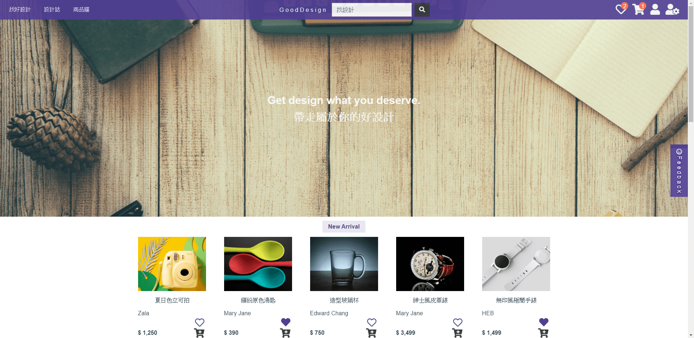

# 我的專案作品 My SPA Project

### GitPage
```
[MyGitPage](https://edward.yihao.nctu.me/#/home)
```
### 關於網站測試及開發
使用的API：[六角API](https://github.com/hexschool/vue-course-api-wiki/wiki)
```
登入使用：
帳號：s2995510@gmail.com
密碼：ink660egg908
```
### 使用的技術
```
* Vue，Vuex
* Javascript，Jquery，Ajax
* Sass，Bootstrap，RWD
* HTML，CSS
```
### 使用的工具
```
* Webpack，Vue-cli
```
### 使用的編輯器
```
* VS Code
```

